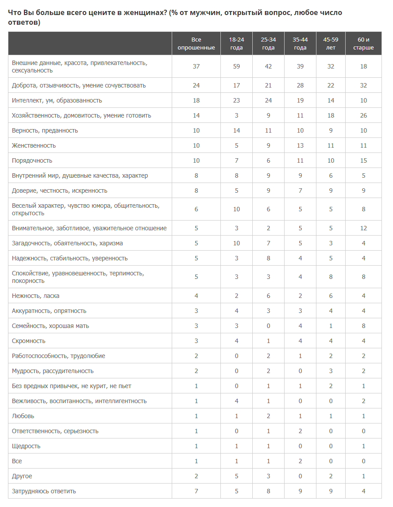
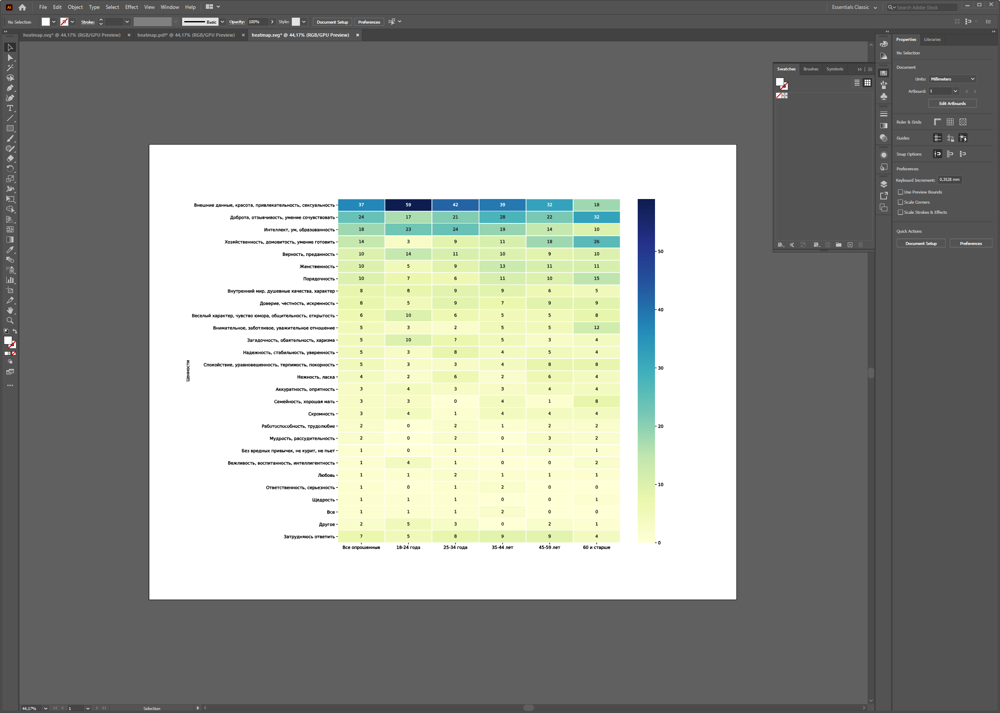

# Как сделать Heatmap за 10 минут!

## Статичный график для дальнейшего изучения или редактирования.

**В репозитории лежит тетрадь jupiter(_heatmap.ipynb_) с кодом и построчными комментрариями!** 

Будем делать график на **Python** и использовать библиотеки **Pandas**, **Seaborn** и **Matplotlib**
Берем таблицу с данными из интернета вот отсюда:https://wciom.ru/index.php?id=236&uid=1140

Преобразовываем.
И на выходе можем сохранит график в форматах: png, pdf, svg.

Векторные форматы открываются в illustrator'е, можно редактировать. К сожалению, "живой" текст получить не удалось.
